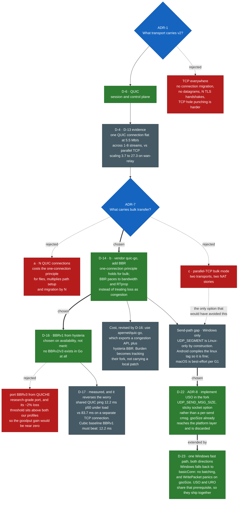
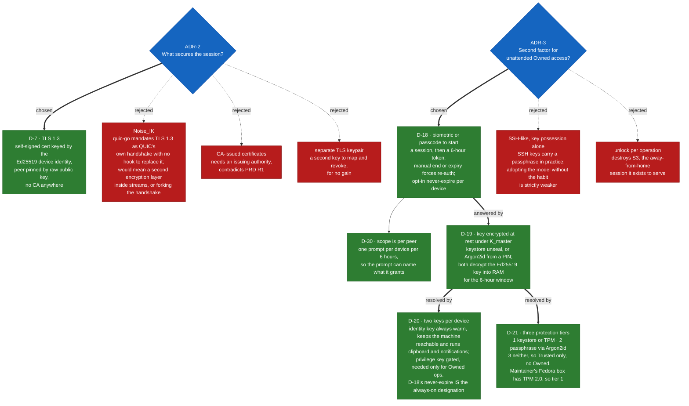
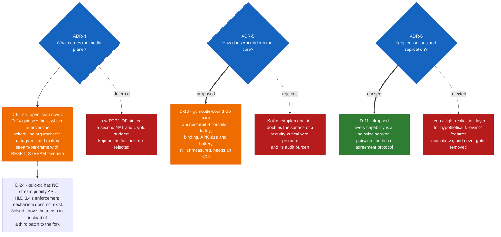
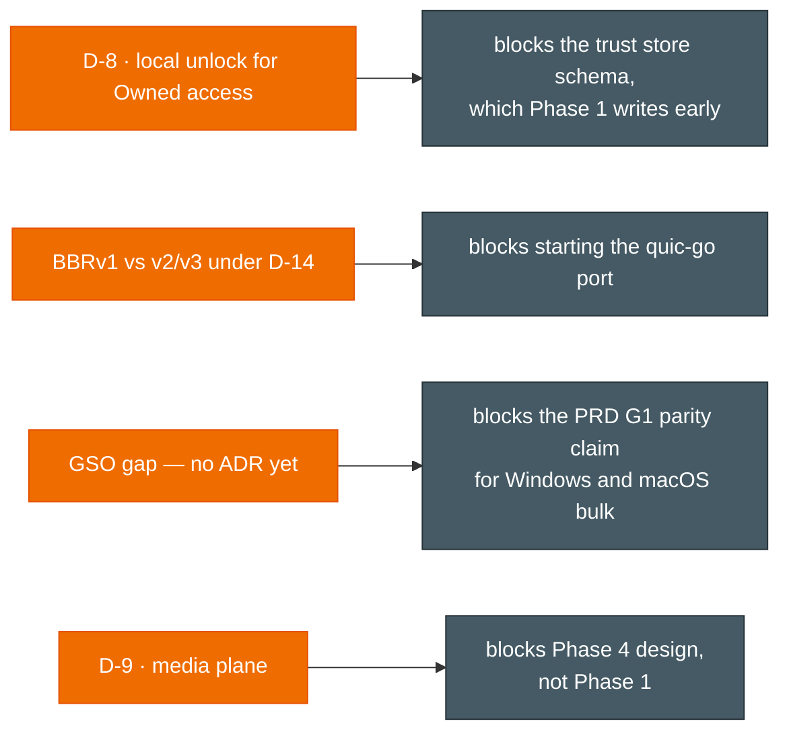

# Decision Tree

How to read this file. The trees below are the **index**: they show which questions were asked, which branches were explored, and which one was taken. The full entries beneath them are the **record**: why each branch was rejected, what was measured, and what each choice costs. A diagram cannot hold rationale, so both exist and the entries remain the normative text.

Append-only. See `AGENTS.md` for format and rules. Do not delete or rewrite past entries — supersede them.

Legend: **green** = accepted · **orange** = open or needs a decision · **red** = considered and rejected · **grey** = evidence · **purple** = superseded.

## Status at a glance

| Entry | ADR | Question | Status |
|---|---|---|---|
| D-1 | — | Where do decisions and code knowledge live? | accepted |
| D-2 | — | Which modules does the project keep? | accepted |
| D-3 | — | When is the transport gate run? | accepted |
| D-4 | — | Does v1.0's parallelism survive on QUIC streams? | evidence · superseded by D-6, D-12 |
| D-5 | — | *(withdrawn — number not reused)* | — |
| D-6 | ADR-1 | What transport carries the session? | **accepted** — QUIC, control plane |
| D-7 | ADR-2 | What secures the session? | **accepted** — TLS 1.3, pinned Ed25519 |
| D-8 | ADR-3 | Second factor for unattended Owned access? | superseded by D-18 |
| D-9 | ADR-4 | What carries the media plane? | open, constrained by D-14 |
| D-10 | ADR-5 | How does Android run the core? | proposed — gomobile |
| D-11 | ADR-6 | Keep consensus/replication? | accepted — dropped |
| D-12 | ADR-7 | What carries bulk transfer? | superseded by D-14 |
| D-13 | — | Full stream-count matrix | evidence |
| D-14 | ADR-7 | What carries bulk transfer? | **accepted** — vendor quic-go + BBR |
| D-15 | — | How is this file organised? | accepted |
| D-16 | ADR-7 sub | BBRv1 or BBRv2/v3? | **accepted** — v1, on availability |
| D-17 | — | What does sharing a connection cost interactive latency? | evidence — less than separate connections |
| D-18 | ADR-3 | Second factor for unattended Owned access? | **accepted** — gate + 6h token |
| D-19 | ADR-3 | How is the device key protected at rest? | accepted — items resolved by D-20, D-21 |
| D-20 | ADR-3 | Can a gated key stay reachable unattended? | **accepted** — split identity/privilege keys |
| D-21 | ADR-3 | What if a device cannot protect its key? | **accepted** — three protection tiers |
| D-22 | ADR-8 | How is the Windows send-path gap closed? | **accepted** — implement USO in the fork |
| D-23 | ADR-8 | Is the receive side separate work? | **accepted** — no, one Windows fast path |
| D-24 | — | How are priority classes enforced? | **accepted** — session-layer bulk quiesce |
| D-25 | — | Consent, session lifecycle, expiry-with-work-in-flight? | **accepted** — hybrid consent, capped grace |
| D-26 | — | Where does v2 code live? | **accepted** — one root module |
| D-27 | — | What does "the fork" mean mechanically? | **accepted** — fork repo + `replace` |
| D-28 | — | Protobuf toolchain? | **accepted** — `buf`, codegen committed |
| D-29 | — | Daemon-to-UI IPC? | **accepted** — reuse the session envelope |
| D-30 | ADR-3 | Is the unlock token per peer or global? | **accepted** — per peer |

**Open right now:** D-9 (media plane, Phase 4) and D-10 (gomobile, needs an NDK to measure). Both need spikes rather than decisions. One optional refinement is flagged for the maintainer in D-30 — ephemeral per-peer delegation keys, which would make per-peer scope cryptographic rather than policy-enforced. Every decision gating Phase 1 is made and the trust store schema is fully determined. ADR-3 is fully resolved across D-18, D-19, D-20 and D-21, so the trust store schema is unblocked. D-16's queueing worry is answered by D-17; what remains is comparing BBRv1 against D-17's Cubic baseline once the port lands.

## Transport — the deep branch



## Security and identity



## Platform and capabilities



## What is still open



---

# Entries

The normative record. Each entry holds the reasoning a diagram cannot.


## D-1: Adopt AGENTS.md + decision log convention
Date: 2026-07-25
Status: accepted
Context: Multiple agents work this repo concurrently; decisions and code logic were living only in commit messages/chat, not discoverable by a fresh agent or contributor.
Decision: Introduce `AGENTS.md` (agent rules), `docs/decisions.md` (this file, ADR-style log), and `docs/functionality.md` (living code map). All agents must read/update these going forward.
Alternatives considered: Rely on commit messages only (rejected — not searchable/summarized, no rationale trail); full ADR tool/format like adr-tools (rejected — overkill for project size, plain markdown is enough).
Consequences: Every future non-trivial decision must be logged here; functionality.md must be kept in sync with code changes.

## D-2: Drop openair-cli, openair-receiver, openair-sender; focus on gui + android only
Date: 2026-07-25
Status: accepted
Context: Repo had four parallel/duplicated Go implementations (standalone sender, standalone receiver, cli, and gui's own internal/sender+receiver) per D-1's open question in functionality.md — unclear ownership, redundant maintenance surface. Project direction narrowed to just the desktop GUI and Android app.
Decision: Delete `openair-cli/`, `openair-receiver/`, `openair-sender/` and their release artifacts (`release/cli/`) entirely. Remove the CLI cross-compile block from `build_release.sh`. `openair-gui` (with its own `internal/sender`, `internal/receiver`) and `openair-android` are now the only supported clients.
Alternatives considered: Keep CLI as a thin wrapper around gui's internal packages (rejected — not asked for, adds scope); archive instead of delete (rejected — user asked for deletion, git history preserves it if needed).
Consequences: `build_release.sh` only builds gui + android. Any protocol/library code shared logic previously duplicated in cli/receiver/sender now lives solely in `openair-gui/internal/*`.

## D-3: Run the v2 transport gate first, before any of the v2 stack
Date: 2026-07-25
Status: accepted
Context: The HLD build order (section 7) puts the `oabench` benchmark gate at the *end* of Phase 1 — after identity, trust store, session, files and manual clipboard. But ADR-1 (transport = QUIC) is marked accepted while PRD risk K1 says userspace QUIC may miss the throughput gate off-Linux. If K1 turns out to be real, that ordering means discovering the foundation is wrong after four layers have been built on it. The whole v2 architecture rests on QUIC; nothing else in Phase 1 is load-bearing in the same way.
Decision: Build `oabench/` as the first piece of v2 work and run the transport gate before writing identity, session or capability code. Harness measures v1.0's N-parallel-TCP engine against a single QUIC connection with N streams, under a shaped network, reporting both goodput and CPU per byte.
Alternatives considered: Follow the HLD order and gate at the end of Phase 1 (rejected — inverts risk ordering; the cheapest week to learn the transport is wrong is week one). Trust ADR-1's existing rationale and skip measurement (rejected — ADR-1's own escape hatch presupposes a benchmark that had never been run). Defer until a Windows machine is available (rejected — see D-4, the decisive result did not need Windows).
Consequences: `oabench` exists as its own Go module and is expected to graduate to `cmd/oabench` in the v2 tree. It produced D-4, which materially changes the design before any of it was built. Its rootless netem lab (`netem/lab.sh`) is reusable as the HLD section 5 CI harness.

## D-4: One QUIC connection per peer does not carry bulk transfer on lossy paths
Date: 2026-07-25
Status: superseded by D-6 and D-12 — the measurements below stand and remain the evidence base for both; only the proposed decision is superseded, split into D-6 (control plane, accepted) and D-12 (bulk path, still open)
Context: HLD principle #1 is "one connection per peer" — all capabilities multiplex over a single QUIC connection, which is what makes "works over NAT, always" structural. v1.0's entire performance thesis is the opposite shape: N independent TCP connections, because networks throttle per-flow rather than in aggregate. D-3's harness measured whether that thesis survives being remapped onto N streams inside one QUIC connection.

Measurements: 192 MiB, median of 2 runs, chunk 1 MiB, single machine.

**All network conditions are emulated**, not measured over real hardware. `netem/lab.sh` applies `tc netem` (rate limit, fixed delay, random loss) to an isolated loopback inside an unprivileged network namespace containing no interface but `lo` and no route off it. No physical NIC, WiFi radio, hotspot or WAN link was involved in any row below. The profile names say which real-world link each preset is *modelling*:

|  | `lan-1g` | `hotspot` | `wifi-5g` | `wan-relay` |
|---|---|---|---|---|
| models this link | wired gigabit Ethernet | phone tethering / device-to-device AP | 5 GHz WiFi via home AP | VPS relay, both peers behind NAT |
| rate | 1 Gb/s | 600 Mb/s | 200 Mb/s | 100 Mb/s |
| RTT | 1 ms | 4 ms | 6 ms | 80 ms |
| loss | 0% | 0.05% | 0.1% | 0.5% |
| TCP best | 952 | 568 | 188 | 27.4 |
| QUIC GSO on | 660 | 559 | 185 | 5.5 |
| QUIC GSO off | 446 | 179 | 93 | 3.3 |

Throughput in Mb/s. Notes on each profile:

- `lan-1g` — wired gigabit Ethernet between two desktops.
- `hotspot` — phone tethering / device-to-device AP, no infrastructure hop; v1.0's 477 Mb/s case.
- `wifi-5g` — 5 GHz WiFi through a home access point; v1.0's 148 Mb/s case.
- `wan-relay` — cross-network hop via a VPS relay, both peers behind NAT (PRD R7/R8).

A fifth profile, `cgnat-punch` (50 Mb/s / 120 ms / 1%, modelling mobile data behind carrier-grade NAT), is defined in `netem/lab.sh` but was not run for this entry.

Emulation fidelity: netem is a token bucket plus fixed delay and uniform random loss. Real WiFi has contention, rate adaptation and bursty loss; a real relay has jitter and competing traffic. Absolute figures are therefore indicative of the modelled link, not predictive of it. What the emulation does support is the *comparison*: TCP and QUIC ran back-to-back under byte-identical conditions with the same framing and chunk size, so any inaccuracy in the model applies equally to both.

Stream scaling on wan-relay, 1/2/4/8 connections or streams:
- TCP: 3.75 / 6.97 / 14.6 / 27.4 Mb/s — near-linear, N independent congestion controllers.
- QUIC: 5.50 / 5.57 / 5.21 / 5.62 Mb/s — **flat**. One connection is one congestion controller; extra streams add no congestion window.

Note QUIC *wins* single-flow (5.5 vs 3.75) — its loss recovery is better per flow. It loses only because it cannot be parallelised the way v1.0 parallelises TCP.

Mechanism: quic-go v0.61 ships only Cubic, in `internal/congestion` with no exported knob and no BBR. Cubic is loss-based, so at 0.5% loss a single flow is pinned near the Mathis limit (~MSS/(RTT·√p)). TCP escapes that ceiling by running N flows; a single QUIC connection cannot.

This is the one result not confounded by the single-machine lab. The gigabit rows are CPU-bound — QUIC costs 15–25 CPU-s/GiB against TCP's 0.3–1.7, and sender, receiver and netem share one core — so `lan-1g` understates QUIC. But `wan-relay` runs at 3–27 Mb/s, nowhere near CPU-bound, and the flat stream-scaling curve is a property of the congestion controller, not of the test rig.

Decision (proposed): Keep one QUIC connection per peer for control, clipboard, notifications, input and remotefs metadata — the multiplexing and NAT benefits are real and the interactive traffic is not throughput-bound. Do **not** assume it carries bulk file transfer or media range-streaming on relayed or lossy paths. Pick one of:
  (a) Multiple QUIC connections for bulk transfer, restoring N congestion controllers. Costs principle #1 for the `files` capability and needs per-connection path setup.
  (b) Fork or vendor a BBR congestion controller into quic-go. BBR does not collapse on non-congestive loss and would likely close most of the gap on one connection. Ongoing maintenance cost against an `internal/` package.
  (c) PRD K1's own escape hatch: parallel-TCP bulk mode reusing v1.0's engine, QUIC for control.
Leaning (b) then (a): BBR preserves the architecture if it works, and is testable with a day of work. This entry stays `proposed` until that test runs.

Alternatives considered: Accept degraded relayed throughput (rejected — PRD R8 requires capability parity across paths and M4 wants seek <3 s on a relayed connection; 5 Mb/s does not stream video). Abandon QUIC for TCP (rejected — QUIC wins single-flow, and streams/datagrams/migration are what make PRD R9 and the mirror capability feasible).

Consequences: ADR-1 stays accepted for the session/control plane but its bulk-transfer assumption is unproven and must be resolved before the `files` capability is written. HLD principle #1 needs a stated exception for bulk. Two secondary findings recorded: (1) K1 is real — disabling GSO costs 50–70% of QUIC throughput and triples CPU on every profile, so the Windows send path needs a real measurement, though it is no longer the *first* problem; (2) QUIC's 10–20× CPU cost per byte is a live risk for PRD R30 (Android battery, <50 MB RSS desktop daemon) and feeds ADR-5.

## D-6: ADR-1 — Transport is QUIC for the session and control plane, not (yet) for bulk
Date: 2026-07-26
Status: accepted
Context: HLD section 6 lists ADR-1 as already accepted, with "parallel-stream bulk mode" as an escape hatch should the benchmark gate fail off-Linux. D-3 built that benchmark and D-4 ran it. The result splits the question: QUIC is sound for everything that is not throughput-bound, and unproven for everything that is. Accepting or rejecting ADR-1 wholesale would misstate the evidence in one direction or the other.
Decision: Accept QUIC (quic-go) as the transport for the session layer, capability negotiation and multiplexing, and the control, clipboard, notification, input and remotefs-metadata capabilities. HLD principle #1 — one connection per peer — holds for all of these. The bulk data path (`files`, remotefs range streaming) is explicitly outside this ADR and is decided in D-12.
Alternatives considered: TCP for everything (rejected — on the emulated relayed profile QUIC beat TCP per flow, 5.5 vs 3.75 Mb/s, and QUIC's streams, datagrams and connection-ID migration are what make PRD R9 live path migration and the `mirror` capability feasible at all; TCP would force a separate mechanism for each). Withhold acceptance until a real Windows measurement exists (rejected — K1 is a throughput risk, and control-plane traffic is not throughput-bound; blocking the session layer on it would stall Phase 1 for a risk that does not apply to it).
Consequences: Session, identity and capability work is unblocked and can proceed on quic-go. K1 still needs a real Windows run, but it now gates only the bulk path. QUIC's measured CPU cost (D-4: 15–25 CPU-s/GiB against TCP's 0.3–1.7) is immaterial at control-traffic volumes but is a live input to D-9 (media plane) and D-10 (Android battery, PRD R30).

## D-7: ADR-2 — Session crypto is TLS 1.3 with self-signed certificates pinned by Ed25519 device key
Date: 2026-07-26
Status: accepted
Context: HLD ADR-2 weighed TLS-1.3-with-pinned-certs against Noise_IK and required a decision "before transport code". D-3's spike implemented the TLS path end to end in `oabench/bench/tlsutil.go` and every benchmark run in D-4 was carried over it, so the option is no longer hypothetical.
Decision: Each device holds one long-term Ed25519 keypair. That same key is the TLS certificate key in a per-device self-signed certificate. Peers are verified in `VerifyPeerCertificate` by comparing the presented raw public key against the pinned one — no certificate authority, no chain building, no hostname validation. DeviceID is truncated SHA-256 of the public key, base32, matching HLD section 3.1.
Alternatives considered: Noise_IK (rejected — quic-go mandates TLS 1.3 as QUIC's own handshake and exposes no hook to substitute another key exchange. Adopting Noise would mean either a second encryption layer running inside QUIC streams, paying framing and CPU twice on a transport already costing 10–20x TCP per byte, or forking quic-go's handshake and owning it. Neither is justified, because pinned TLS 1.3 already delivers the property Noise_IK was wanted for: authentication by key possession rather than by any authority). CA-issued certificates (rejected — requires an issuing authority, contradicting PRD R1's "no accounts, no server-side identity"). A separate TLS keypair distinct from the device identity key (rejected — Go's crypto/tls signs with Ed25519 under TLS 1.3, so one key serves both roles; a second keypair would add a mapping to maintain and a second thing to revoke, for no gain).
Consequences: Transport and identity work are unblocked; this was the stated blocker in HLD section 6. Pinning makes key rotation a protocol concern — a device whose key changes hard-fails until re-paired, which PRD R2 already specifies as intended. Relays and rendezvous observe ciphertext and routing metadata only, satisfying R27. The spike's fixed Ed25519 seed exists solely so the benchmark client can pin the server without an out-of-band exchange and must not reach the daemon; production keys are generated per install and persisted in the trust store.

## D-8: ADR-3 — Owned-level access requires a local unlock to start a session
Date: 2026-07-26
Status: superseded by D-18 — the gate was accepted with a specified token lifetime, which this entry left open
Context: PRD K10 and R3. Unattended "Owned" access is the feature that makes S3 (working from a hostel network against a machine nobody is sitting at) possible, and it is also the feature that makes a stolen paired laptop equivalent to owning every other machine. The open question was whether to require a second factor to *use* Owned access or to accept SSH-like semantics where possession of the key is sufficient.
Decision (proposed): Require a device-local unlock (OS biometric or PIN) to *initiate* an Owned-level session. Configurable per device, default on. Do not require re-authentication per operation within a live session.
Rationale: the threat being defended against is an unattended or stolen device, which a session-initiation gate covers. Gating each operation instead would defend against nothing extra in that scenario while making the away-from-home working session unusable.
Alternatives considered: SSH-like, key possession alone (rejected as the default — SSH keys in practice are protected by a passphrase plus an agent that caches it, which is structurally the same design as proposed here; adopting SSH's model minus SSH's passphrase habit would be strictly weaker than the comparison implies). Per-operation unlock (rejected — destroys S3, the scenario unattended access exists to serve). No second factor at all, documented as accepted risk (rejected — R3 already makes promotion to Owned a deliberate act; leaving the resulting capability entirely unguarded is inconsistent with that care).
Consequences: Requires a local-authentication adapter in the per-platform shells on all three OSes, joining `Clipboard`, `Notifier`, `Capturer` and `Injector`. Adds a field to the trust-store record, which is why this must be settled before the trust store schema is written — retrofitting a schema change across already-paired devices is a migration worth avoiding. This is a product tradeoff rather than an engineering one, so it is flagged for explicit sign-off rather than resolved by evidence.

## D-9: ADR-4 — Media plane decision deferred until the bulk path is settled
Date: 2026-07-26
Status: proposed — open, lean moved to option C by D-24. Was blocked on D-12; D-14 resolved that by keeping bulk on the one connection, and D-24 then removed the scheduling argument that favoured datagrams
Context: HLD ADR-4 leans toward QUIC datagrams for the `mirror` capability, with a Moonlight-style raw RTP-over-UDP sidecar as the fallback if datagrams cannot hold latency. D-3's spike measured streams only; datagrams were not exercised, so no direct evidence exists yet.
Decision (proposed): Still try datagrams first, but decide this only after D-12, because two findings from D-4 change the inputs. First, QUIC's CPU cost of 15–25 CPU-s/GiB is comfortable at mirror bitrates on a desktop but is an open question on Android at high bitrate, feeding D-10. Second, and more structurally: RFC 9221 datagrams are congestion-controlled by the connection they ride on, so on a single QUIC connection the mirror stream shares one congestion controller with everything else — including bulk file transfer. That is the same single-controller property that sank bulk throughput in D-4. If D-12 moves bulk off this connection, the contention disappears and datagrams look considerably better; if it does not, `mirror` and `files` compete for one congestion window and HLD's priority classes have to carry the entire burden of keeping latency bounded.
Alternatives considered: Commit to the raw RTP/UDP sidecar now (rejected — it introduces a second NAT-traversal surface and a second crypto surface to audit, which is precisely what one-connection-per-peer exists to avoid; the datagram path has not been shown to fail, only shown to be coupled to an unresolved decision).
Consequences: Needs its own spike once D-12 lands, measuring datagram goodput and latency under loss, and specifically latency while a bulk transfer shares the same connection. `oabench` already has the shaped lab; it needs a datagram mode and a latency histogram.

## D-10: ADR-5 — Android core is the gomobile-bound Go core
Date: 2026-07-26
Status: proposed
Context: HLD ADR-5 weighs a gomobile-bound Go core against reimplementing the protocol in Kotlin. PRD G1 requires Android to be first-class from Phase 1, so this cannot be deferred past Phase 1 planning.
Evidence from D-3: `CGO_ENABLED=0 GOOS=android GOARCH=arm64 go build` succeeds for quic-go and the whole benchmark module, so the transport is portable to Android as pure Go and the "does it even compile for Android" risk is retired. Not answered, because no Android NDK was available on the development machine: gomobile binding friction, APK size delta, on-device throughput, and battery cost.
Decision (proposed): gomobile-bound Go core, one protocol implementation shared across all platforms.
Alternatives considered: Kotlin reimplementation of the protocol (rejected pending contrary evidence — it doubles the implementation surface of a security-critical wire protocol and doubles the audit burden for end-to-end crypto, and PRD R32's mixed-version capability negotiation is materially harder to keep correct across two independent codebases than across one). Defer Android to Phase 2 (rejected — directly contradicts PRD G1 and the Phase 1 exit criteria).
Consequences: A follow-up spike must install the NDK and measure `gomobile bind`, APK size delta, and on-device throughput before this moves to accepted. D-4's CPU finding is a direct risk to PRD R30's Android battery budget and must be measured on a real mid-range device rather than a Pixel, per PRD K5. If binding friction or APK size proves prohibitive, the fallback is not Kotlin reimplementation but running the Go core in a separate process and speaking the local IPC protocol the desktop shells already use.

## D-11: ADR-6 — No consensus or replication layer
Date: 2026-07-26
Status: accepted
Context: An earlier 2.0 protocol draft carried a consensus mechanism (STPB) and manifest replication, designed for multi-device coordination. HLD section 6 records these as explicitly dropped for the current vision; this entry makes that a logged decision rather than a note in a design document.
Decision: No consensus protocol and no manifest replication in v2. Every capability is a pairwise session between exactly two devices, and pairwise sessions require no agreement protocol.
Alternatives considered: Retain a lightweight replication layer for possible future N>2 features (rejected — speculative. PRD NG2 rules out multi-user sharing entirely, and the only plausible N>2 case is a single clipboard shared across N devices with conflict resolution, which is not in scope. Building an agreement layer against a hypothetical is the kind of cost that never gets removed once present).
Consequences: Revisit only if a capability genuinely requires agreement among three or more devices. Worth noting for future readers: chunk manifests still exist in the `files` capability for resume-after-interruption (PRD R13), and that is per-transfer bookkeeping, not replication — the name collision with the dropped "manifest replication" should not be read as resume having been dropped too.

## D-12: ADR-7 — Bulk transport path is undecided; the BBR experiment is the gate
Date: 2026-07-26
Status: superseded by D-14 — the option analysis below stands as the record of what was weighed; option (b) was chosen
Context: The HLD lists no ADR for the bulk data path, because it assumed one QUIC connection carries every capability. D-4 measured that assumption and it does not hold on lossy paths: on the emulated relayed profile, TCP scales 3.75 to 27.4 Mb/s across one to eight connections while QUIC stays flat at roughly 5.5 Mb/s across one to eight streams. quic-go v0.61 ships only Cubic, in `internal/congestion`, with no BBR and no exported knob, so a single connection is a single loss-based flow pinned near the Mathis limit. v1.0's entire performance thesis was N independent congestion controllers, and streams inside one connection do not reproduce it. The relayed path is exactly where this matters most, since PRD R8 requires capability parity across paths and the relay is the always-available fallback.
Decision (proposed): None yet. Options, in the order they should be *tested* — which is not the order of preference, because the cheapest experiment is not the preferred outcome:
  (a) Multiple QUIC connections for bulk transfer, restoring N congestion controllers. **Test this first**, not because it is preferred but because it is nearly free: `oabench` already dials one connection with N streams, and dialling N connections with one stream each is a small change plus a rerun of the `wan-relay` profile. It bounds the problem — it establishes the ceiling any single-connection solution would have to reach, and yields a working fallback either way. Costs principle #1 for the `files` capability specifically, and multiplies path setup, hole punching and migration work by N.
  (b) Vendor or fork a BBR congestion controller into quic-go. BBR probes for bandwidth and delay rather than treating loss as congestion, so it does not collapse at 0.5% loss the way Cubic does, and it is the only option that leaves principle #1 intact. **Correction to an earlier draft of this entry, which called this cheap to test: it is not.** Verified 2026-07-26: neither quic-go v0.61 nor the apernet fork ships BBR. `internal/congestion` defines a `SendAlgorithm` interface, so the seam exists, but it is unexported and there is no injection point — using BBR means vendoring quic-go and porting an implementation (hysteria's Go BBR is the obvious candidate), then carrying that patch across upstream releases. Days of work plus validation, not a day. Worth it only if (a) confirms the ceiling is high enough to be worth chasing.
  (c) PRD K1's own escape hatch: parallel-TCP bulk mode reusing v1.0's engine with QUIC for control. Known to work, since it is v1.0, but it means two transports, two NAT stories, and TCP hole punching is materially harder than UDP.
Alternatives considered: Accept degraded throughput on relayed paths (rejected — PRD R8 requires parity across paths and M4 targets seek under 3 s over a relayed connection; 5.5 Mb/s does not stream video). Abandon QUIC entirely (rejected — see D-6; QUIC wins per flow and carries the control plane well).
Consequences: Blocks the `files` capability and couples to D-9, since whether bulk shares the media connection changes the datagram calculus. Whichever option wins, HLD principle #1 needs an explicitly stated exception or an explicit reaffirmation. The deciding experiment is a congestion-control swap plus a rerun of the `wan-relay` profile in `oabench`.

## D-13: Multiplexing helps neither transport on clean links; QUIC degrades past two streams; GSO is Linux-only by construction
Date: 2026-07-26
Status: accepted (evidence entry; extends D-4, changes no decision)
Context: D-4 reported one "best" throughput figure per profile and broke out stream scaling only for `wan-relay`. That collapsed away the comparison the whole spike was built to make — multiplexed QUIC with GSO enabled against v1.0's multiplexed TCP, at matched stream counts, on every profile. The data existed in `oabench/netem/results-2026-07-25.jsonl` from the original run and was simply not surfaced. This entry publishes it, and adds one finding obtained by reading quic-go rather than by measurement.

Full matrix, Mb/s, by stream/connection count. Same run as D-4 (192 MiB, median of 2, 1 MiB chunks, single machine, emulated conditions per D-4's fidelity note):

| profile | config | 1 | 2 | 4 | 8 |
|---|---|---|---|---|---|
| `lan-1g` | TCP | 933.8 | 950.2 | 952.8 | 952.3 |
| | QUIC GSO on | 645.2 | 660.6 | 626.2 | 507.0 |
| | QUIC GSO off | 303.3 | 419.7 | 446.8 | 424.0 |
| `hotspot` | TCP | 554.6 | 562.7 | 565.0 | 568.3 |
| | QUIC GSO on | 505.2 | 559.8 | 537.8 | 446.7 |
| | QUIC GSO off | 159.4 | 179.2 | 178.3 | 163.7 |
| `wifi-5g` | TCP | 188.7 | 188.0 | 188.1 | 187.2 |
| | QUIC GSO on | 165.9 | 185.4 | 175.3 | 180.0 |
| | QUIC GSO off | 91.1 | 92.3 | 91.7 | 93.9 |
| `wan-relay` | TCP | 3.7 | 6.9 | 14.6 | 27.3 |
| | QUIC GSO on | 5.5 | 5.5 | 5.2 | 5.6 |
| | QUIC GSO off | 3.3 | 3.2 | 3.3 | 3.3 |

Findings:

1. **On clean links, multiplexing buys nothing — for either transport.** A single TCP connection already saturates every lossless profile: 933.8 of 952.3 on `lan-1g`, 554.6 of 568.3 on `hotspot`, 188.7 on `wifi-5g` where more connections make it marginally *worse*. v1.0's parallel-connection trick is not a general throughput mechanism; it is specifically a loss-and-latency mechanism. This reframes v1.0's headline result: the 5–10x it reports came from links where a single flow was being held back, not from parallelism being inherently faster.

2. **Multiplexing never helps QUIC, and hurts it past two streams.** GSO-on peaks at two streams on every profile and then declines — `lan-1g` 660.6 down to 507.0, `hotspot` 559.8 down to 446.7. Extra streams add scheduling and per-stream bookkeeping against one congestion window and one sender loop, so they cost without buying. Practical consequence: if QUIC carries bulk, the stream count should be about two, not the eight v1.0 uses. D-12's option (a) must therefore be read as multiple *connections*, not more streams — more streams is already measured and does not work.

3. **TCP's advantage exists only under loss, and only through parallelism.** `wan-relay` is the sole profile where the transports diverge on scaling: TCP 3.7 to 27.3 near-linearly, QUIC flat at ~5.5. Per single flow QUIC wins there (5.5 against 3.7). Restated: QUIC is the better protocol per flow and loses solely because it cannot be run N-up inside one connection.

4. **GSO is Linux-only by construction, so the "GSO off" row is what Windows and macOS get — permanently.** Established by reading quic-go v0.61, not by measurement: `isGSOEnabled` returns a hardcoded `false` in `sys_conn_helper_darwin.go` and `sys_conn_helper_freebsd.go`, and `appendUDPSegmentSizeMsg` is a no-op stub in `sys_conn_helper_nonlinux.go`, which is what Windows compiles against. Only `sys_conn_helper_linux.go` implements `UDP_SEGMENT`. This upgrades PRD risk K1 from "a risk to be measured on a Windows machine" to a property of the library: on Windows and macOS, QUIC bulk throughput is the GSO-off row — 93 of TCP's 188 on `wifi-5g`, 179 of 568 on `hotspot`, 446 of 952 on `lan-1g`.

Consequences: No decision changes. D-12's framing is refined — its option (a) is multiple connections, since additional streams are now measured as counterproductive, and its BBR option (b) addresses finding 3 but not finding 4, which no congestion controller can fix. Finding 4 is a direct problem for PRD G1's "Windows and Linux and Android are all first-class, with parity as the bar", and should be weighed in D-12 alongside throughput: options (a) and (b) both leave Windows on the degraded send path, whereas option (c), parallel TCP for bulk, is the only one that does not. The clean-link QUIC shortfall in this table is still subject to D-4's co-location caveat and may narrow on two real machines; findings 1, 2 and 4 do not depend on that caveat.

## D-14: ADR-7 resolved — vendor quic-go and add BBR; one connection per peer stands
Date: 2026-07-26
Status: accepted (supersedes D-12)
Context: D-12 left the bulk transport path open with three options. D-4 and D-13 established that a single Cubic-driven QUIC connection is pinned near the Mathis limit on lossy paths — 5.5 Mb/s on `wan-relay` against parallel TCP's 27.3 — and that adding streams inside that connection does not help and past two streams actively hurts. Maintainer decision, supported by a BBR-versus-multiplexed-CUBIC model showing BBR holding near line rate across a loss range where aggregate CUBIC decays steeply: take option (b).
Decision: Vendor quic-go and add a BBR congestion controller for the bulk data path. HLD principle #1 — one connection per peer — stands unchanged for every capability, `files` and `remotefs` included. Options (a) multiple QUIC connections and (c) parallel-TCP bulk mode are not pursued.
Rationale: BBR estimates bottleneck bandwidth and round-trip propagation time and paces to those estimates, rather than treating every loss as a congestion signal. Non-congestive loss — wireless bit errors, relay drops — therefore does not shrink its sending rate the way it shrinks Cubic's. This is consistent with the published BBR results, which show the same shape as the model that prompted this decision. Keeping one connection per peer preserves NAT traversal, connection migration (PRD R9) and the session-layer priority classes for bulk as well as control, which neither (a) nor (c) does.

What this decision does **not** resolve, stated explicitly so it is not mistaken for settled:
- **GSO.** Per D-13 finding 4, quic-go's `UDP_SEGMENT` path is Linux-only by construction. BBR changes the congestion window; it does not change the send path. A Windows sender measured at 446 Mb/s on the `lan-1g` profile is syscall-bound, not congestion-bound, and BBR will not lift that ceiling. PRD K1 and the G1 parity bar remain open and now need a separate answer — this decision narrows the bulk problem to one platform rather than eliminating it.
- **The model is a model.** The chart behind this decision is a simulator; its BBR line sits at exactly link rate across the entire loss range, whereas real BBR has a bandwidth-probing cycle and does not achieve full utilisation. The port must be validated with `oabench` on the `wan-relay` profile against D-13's table before the gap is considered closed.

Alternatives considered: (a) Multiple QUIC connections for bulk (rejected — costs principle #1 for the `files` capability, multiplies path setup, hole punching and migration by N, and per D-13 it would have to be N connections rather than N streams, making it more work than D-12 assumed). (c) Parallel-TCP bulk mode reusing v1.0's engine (rejected — two transports, two NAT stories, and TCP hole punching is materially harder than UDP. Noted honestly: it is the only option that sidesteps the GSO gap entirely, which is why that gap is now tracked as an open item above rather than treated as dismissed).

Consequences:
- quic-go becomes a vendored dependency rather than a module requirement. Every upstream release, security releases included, must be re-merged against the local congestion-control patch. This is a standing cost on a security-critical component and should be budgeted explicitly, not absorbed silently.
- Sub-decision required before implementation: BBRv1 versus BBRv2/v3. v1 is effectively loss-agnostic and matches the model's shape; v2 and v3 reintroduce loss as an input, are fairer to competing loss-based flows, and would show a smaller gain on the `wan-relay` profile. Most available Go ports are v1; hysteria's implementation is the obvious starting point.
- BBRv1 is known to be aggressive toward loss-based flows sharing a bottleneck and can sustain standing queues. On a shared relay, or a home link carrying other traffic, that is a real externality — and it sits uneasily beside v1.0's own noted throughput-versus-fairness trade-off. Worth measuring rather than assuming, particularly since a self-hosted relay may carry several of the user's own transfers at once.
- Unblocks the `files` capability. Also constrains D-9 (ADR-4): with bulk remaining on the single connection, `mirror` datagrams share one congestion controller with bulk transfers, so the media plane must now be designed under that assumption and the session layer's priority classes carry real weight rather than being a nicety.
- Follow-up work: port BBR against the `SendAlgorithm` interface in `internal/congestion`, then rerun the `oabench` `wan-relay` profile and compare against D-13. The harness and baseline already exist.

## D-15: Decision log becomes a decision tree; `decisions.md` renamed to `decision-tree.md`
Date: 2026-07-26
Status: accepted
Context: The log had reached thirteen entries with two supersession chains — D-4 into D-6 and D-12, then D-12 into D-14. Read top to bottom it no longer showed what it had actually become: a record of branch points where several options were explored and one was taken. A reader arriving fresh could not see at a glance which questions were still open, or why a rejected option still mattered. D-14's GSO caveat, for instance, only makes sense if you know that option (c) was the one branch that would have avoided it.
Decision: Rename `docs/decisions.md` to `docs/decision-tree.md` and place Mermaid decision trees at the top as an index, above the unchanged entries. The trees show the questions asked, the branches explored, the branch taken, and what remains open. The entries beneath stay the normative record.
Alternatives considered: Replace the prose entries with the diagrams alone (rejected — a diagram cannot carry why a branch was rejected, what was measured, or what a choice costs, and that rationale is the entire reason D-1 created the log; the shape of a decision is not the same artefact as its justification). Keep `decisions.md` and add a separate `decision-tree.md` index (rejected — two files drift apart, and an index is only trustworthy sitting beside what it indexes). Keep the flat log and rely on the Status field alone (rejected — supersession chains are exactly what a flat list renders badly, which is the problem being solved).
Consequences: `AGENTS.md` sections 1 and 3, `docs/functionality.md`, `docs/openair2-hld.md` and `oabench/README.md` updated to the new path. The trees become a maintenance surface — any agent adding an entry must add its node and update the status table in the same commit, because an index that silently disagrees with the entries is worse than no index at all; `AGENTS.md` section 1 now states this. Rendering depends on Mermaid support: GitHub renders it inline, other viewers see the fenced source, which is why the status table above the diagrams is prose rather than an image and remains readable without a renderer.

## D-16: BBRv1 for the vendored congestion controller; corrects D-14's vendoring cost
Date: 2026-07-26
Status: accepted
Context: D-14 chose BBR for the bulk path and left "BBRv1 versus BBRv2/v3" as an explicit sub-decision. On algorithm merits v2/v3 win outright: v1 ignores loss entirely, so on shallow-buffered links it induces loss and sustains high retransmit rates; it is unfair to loss-based flows sharing a bottleneck; it exhibits RTT-unfairness among BBR flows; its roughly 2×BDP inflight cap holds a standing queue; and ProbeRTT collapses inflight to a few packets for about 200 ms every ten seconds. v2 and v3 were built to fix exactly those, adding bounded loss and ECN response, a gentler ProbeRTT, and better ACK-aggregation modelling.
Decision: BBRv1, taken from hysteria's implementation. This is a decision on availability, not on merit.
Evidence, verified 2026-07-26: no BBRv2 or BBRv3 exists in Go. Upstream quic-go v0.61 has no BBR at all; the metacubex fork has none. The one maintained Go implementation is `github.com/apernet/hysteria/core/v2@v2.10.0/internal/congestion/bbr` — 2619 lines, MIT licensed and therefore GPL-3.0 compatible with attribution, and confirmed v1 by inspection: the four-mode STARTUP/DRAIN/PROBE_BW/PROBE_RTT state machine, `defaultHighGain = 2.885`, and no `inflight_hi`, loss-threshold or ECN markers anywhere. v2/v3 exist only in Linux TCP (C) and QUICHE (C++); porting one is a from-scratch implementation of a subtle algorithm, not an adaptation.
Second reason the choice costs less than it appears: **v3 would not buy much throughput on OpenAir's own profiles.** Its loss response is threshold-based at roughly 2%, while `wan-relay` is 0.5% and `cgnat-punch` is 1% — both under it. On the paths this project actually models, v3 would hold throughput much as v1 does. The gap between them here is fairness and queueing, not goodput.
**Correction to D-14.** That entry states vendoring means maintaining a patch against quic-go's `internal/` package, with every upstream security release re-merged. That is no longer the cheapest path. Hysteria's BBR imports `github.com/apernet/quic-go/congestion` — an *exported* package — and installs it on a live connection with `congestion.UseConfigured(conn, type, profile)`. The apernet fork has already solved the injection problem by making congestion control public API. The dependency therefore becomes apernet/quic-go plus hysteria's BBR, and the maintenance burden shifts from carrying a local patch to tracking someone else's fork. That fork sits at v0.60.1 against upstream v0.61.0, so it is roughly current, but the risk changes shape rather than disappearing: a fork that stops tracking upstream is a security-relevant dependency going stale, and that needs watching.
Alternatives considered: Port BBRv3 from QUICHE (rejected — research-grade effort on a subtle algorithm, for a throughput gain that the threshold analysis above says would be near zero on these profiles). Wait for upstream quic-go to add BBR (rejected — no indication it is coming, and it would block the `files` capability indefinitely). Use hysteria's "Brutal" fixed-rate controller, which ships alongside its BBR (rejected — it disregards congestion signals by design, which is defensible for a circumvention tool on a path you have measured, and indefensible as the default for a general file-transfer product on other people's networks).
Consequences: The one v1 defect that genuinely bites this architecture is queueing, not fairness. D-14 keeps bulk on the same connection as clipboard, input and eventually `mirror` datagrams, and BBRv1's standing queue and ProbeRTT dips add latency to everything sharing that congestion controller — RFC 9221 datagrams bypass stream flow control but not the pacer. That works directly against HLD's sub-50 ms glass-to-glass target and its requirement that input never queue behind bulk. Mitigation is a knob rather than a rewrite: hysteria's BBR exposes gain profiles, one constructor using `highGain: 2.25` against the `2.885` default, trading throughput for a shorter queue. The fairness objection is real but is not a regression — v1.0 already ships eight parallel CUBIC flows, which takes eight shares of a bottleneck, so a single BBRv1 flow is if anything a better network citizen than what the project ships today. This must be measured rather than assumed: `oabench` gains a latency probe (see `docs/functionality.md`) that pings on a stream and on a datagram while a bulk transfer saturates the same connection, reporting idle and busy percentiles so the queueing cost of a controller is visible instead of inferred. Cubic numbers are the baseline to beat; BBRv1 is measured against them when the port lands.

## D-17: Sharing one connection costs less interactive latency than separate connections; netem queue depth corrected
Date: 2026-07-26
Status: accepted (evidence entry; delivers the measurement D-16 asked for)
Context: D-16 flagged BBRv1's standing queue and ProbeRTT dips as the one defect that genuinely bites this architecture, because D-14 keeps bulk on the same connection as clipboard, input and eventually `mirror` datagrams, and required the cost be measured rather than assumed. `oabench` gained a latency probe: a request/response ping on a QUIC stream and over RFC 9221 datagrams, and for TCP on its own separate connection — mirroring v1.0's architecture, where control never shared a socket with bulk. Sampled for two seconds idle, then continuously while the bulk transfer saturates the link, reported as percentiles.

Method note, and a correction to the lab: the netem queue was previously a flat `limit 100000` packets — roughly 150 MB, over a hundred times the bandwidth-delay product of every profile. That was chosen to stop netem manufacturing loss on high-BDP paths and overshot into extreme bufferbloat, which inflated latency-under-load by more than an order of magnitude and measured the lab rather than the transport. `netem/lab.sh` now derives the limit from the BDP, defaulting to 4×, overridable with `BUFFER_BDP`. Throughput conclusions in D-4 and D-13 are unaffected — re-measured `wifi-5g` at 4 streams gives TCP 186.4 Mb/s against D-13's 188.1, and QUIC GSO-on 183.1 against 175.3, both within run-to-run noise — because those profiles were bandwidth- or loss-limited rather than queue-limited. Latency conclusions would have been badly wrong.

Measurements, `wifi-5g` profile, 48 MiB, 4 streams/connections, milliseconds:

| buffer | path | idle p50 | busy p50 | busy p99 | busy max | goodput |
|---|---|---|---|---|---|---|
| 4×BDP | TCP, separate connection | 6.53 | **83.71** | 109.43 | 109.43 | 186.4 |
| 4×BDP | QUIC stream, shared | 6.96 | **12.17** | 23.19 | 23.35 | 183.1 |
| 4×BDP | QUIC datagram, shared | 7.00 | 11.85 | 22.48 | 22.57 | — |
| 1×BDP | TCP, separate connection | 6.53 | 22.89 | 49.71 | **246.80** | 166.9 |
| 1×BDP | QUIC stream, shared | 7.01 | 21.79 | 29.74 | 30.24 | 187.8 |
| 1×BDP | QUIC datagram, shared | 7.02 | 21.41 | 29.33 | 30.12 | — |

Findings:

1. **Separate connections buy no latency isolation.** This is the result that matters and it is not what D-16 anticipated. At consumer-typical buffering, a ping on its own TCP connection suffers 83.71 ms while bulk runs, against 12.17 ms for a ping sharing the QUIC connection with that same bulk — a factor of seven the other way. Transport-level separation does not isolate you from queueing at the bottleneck, because the bottleneck queue is shared no matter how many connections you open. v1.0's architecture, where control has its own socket, therefore provides far less protection for interactive traffic than its shape suggests.

2. **The shared-connection design is a latency asset, not the liability D-16 implied.** One congestion controller means one entity deciding how much is in flight; four independent CUBIC flows each fill the queue with no knowledge of the others. D-16's concern about BBRv1 is not thereby void — BBR could still worsen QUIC's numbers, and that is the comparison to run once the port lands — but the premise that sharing a connection is what puts interactive traffic at risk is wrong, and the Cubic baseline it must beat is 12.17 ms p50, not TCP's 83.71.

3. **QUIC is markedly less buffer-sensitive.** Dropping from 4× to 1× BDP costs TCP throughput (186.4 down to 166.9) while still leaving it a worse tail (max 246.80 ms against QUIC's 30.24). QUIC holds goodput at both depths, 183.1 and 187.8, which is what sender-side pacing is for. Shallow buffers are the case OpenAir cannot control — other people's networks — and it is where the gap widens.

4. **Datagrams and streams behave alike under load.** 11.85 against 12.17 ms at 4×BDP. Datagrams skip stream flow control but are paced by the same congestion controller, so on this evidence they offer no latency advantage for small messages. That bears on D-9 (ADR-4): the case for a datagram media plane rests on avoiding retransmission of stale video, not on lower latency per message.

Consequences: The Cubic baseline for the BBRv1 comparison is recorded above; when the port lands, rerun `oabench send -probe` on the same profiles and compare against this table rather than against intuition. `BUFFER_BDP` is now the knob for studying bufferbloat deliberately, and the default of 4 should be stated whenever latency figures are quoted. One caveat carried from D-4: this is still a single machine with sender, receiver and netem sharing a core, so absolute latencies include scheduling noise; the comparison between transports under identical conditions is the trustworthy part. HLD's priority classes remain worth building — nothing here measures input contending with bulk *inside* one QUIC connection under stream prioritisation, only that the connection as a whole queues less than four TCP flows do.

## D-18: ADR-3 resolved — biometric/passcode gate with a 6-hour session token
Date: 2026-07-26
Status: accepted (supersedes D-8)
Context: D-8 proposed a local unlock to start an Owned-level session but left the lifetime of that unlock unspecified, which is the parameter that actually determines how long a stolen device stays useful. PRD K10 is the underlying risk: unattended access means possession of a paired device's key is possession of every machine it is paired with.
Decision: Maintainer-specified flow.

```
Start session -> biometric/passcode challenge -> success -> grant session token
   |
   +-- default: 6-hour timer
   |      |-- 6 hours elapse ----+
   |      |-- manual session end +--> invalidate local token -> re-auth required for next access
   |
   +-- opt-in "never": active until manual revoke
```

The challenge gates *starting* a session, not each operation within it, preserving S3 — the away-from-home working session that unattended access exists to serve. Default expiry is six hours; "never" is available but must be opted into per device.

**Required refinement, or the gate is only a policy flag.** As drawn, the token is local state consulted by our own daemon. An attacker who has the machine can bypass a check their own copy of the software performs, because the thing that actually authenticates to peers is the Ed25519 device key from D-7, which sits on disk. To make the gate cryptographically real, the device private key must itself be sealed in the platform keystore with user-presence required — Android Keystore with `setUserAuthenticationRequired`, Windows Hello via CNG, and on Linux the TPM where present. The "session token" is then the unlocked key handle rather than a boolean, and expiry means dropping that handle so the key genuinely cannot be used until the user authenticates again. Without this the design raises the bar against casual theft — a stolen unlocked laptop, someone sitting down at your desk — but not against an attacker who can read the filesystem. Which of those two properties is being claimed must be stated plainly in the threat model PRD R29 requires; they are very different guarantees.

**Platform gap.** Biometrics are not uniformly available. Android has BiometricPrompt and Windows has Hello, both solid. Linux has no standard biometric API — fprintd coverage is patchy and polkit is not a biometric prompt — so the guaranteed path there is the passcode branch of the diagram. That means OpenAir defines and verifies a credential of its own on Linux: a PIN, which must be stored as a KDF hash (argon2id) and never alongside the sealed key, with rate limiting on attempts. That is new attack surface introduced by this decision and it belongs in the threat model rather than being discovered during implementation.

Alternatives considered: Key possession alone, SSH-like (rejected in D-8 and still rejected — SSH keys carry a passphrase plus an agent in practice, and adopting the model without that habit is strictly weaker than the comparison suggests). Unlock per operation (rejected in D-8 — destroys S3). A sliding rather than absolute six-hour window (rejected — a sliding window means an attacker who keeps the session active is never locked out, which inverts the purpose; the timer is absolute from grant).

Consequences and questions this decision creates, to settle before the trust store schema is written:
- **Token scope.** Per paired peer, or one token covering all Owned devices? Per-peer is the stronger property and the more annoying one. Unspecified above; needs a call.
- **Behaviour at expiry with work in flight.** A 20 GB transfer at the 5h59m mark should not be destroyed by the timer. Proposed: expiry blocks *new* operations while permitting in-flight ones to finish, since those were authorised when they began. This interacts with PRD R13's resumable transfers and should be explicit.
- **"Never" must be as deliberate as promotion to Owned.** PRD R3 already makes promotion an explicit act on the target machine; an unlimited token should be equally visible and equally revocable, and ought to appear in the paired-device list rather than hiding in settings.
- **Auth events belong in the session log.** PRD R4 gives the accessed device a visible indicator and a local log. Unlock, expiry and manual end are exactly the events that log exists to make auditable, and they are initiator-side, so both ends need a record.
- Trust store record gains the fields this implies: `authPolicy` (timed | never), `tokenGrantedAt`, and whether the device key is keystore-sealed on this platform — the last because it will not be true everywhere at first, and a peer should be able to tell.
- Adds a `LocalAuth` adapter to the per-platform shells alongside `Clipboard`, `Notifier`, `Capturer` and `Injector`.

## D-19: Key-at-rest design for D-18 — keystore or Argon2id, converging on an in-RAM Ed25519 key
Date: 2026-07-26
Status: accepted, with two unresolved items called out below
Context: D-18 recorded the auth gate and 6-hour token, and flagged that as drawn the token was local state our own daemon consults — bypassable by anyone holding the machine, because the D-7 Ed25519 key authenticating to peers sits on disk. This entry records the maintainer's key-management design, which closes that gap.
Decision:

```
Request Owned session access
   |
   +-- OS biometrics available? --YES--> OS biometric challenge
   |                                       -> unseal K_master from platform keystore
   |
   +---------------------------- NO ----> application PIN / passcode
                                           -> derive K_master via Argon2id(PIN + salt)
   |
   +--> both converge: decrypt the Ed25519 device key into RAM,
        hold the decrypted state for 6 hours (D-18's token)
```

The Ed25519 key is stored encrypted at rest under `K_master`. The 6-hour token of D-18 is now concretely the lifetime of the decrypted key in memory, so expiry is a wipe rather than a policy check. Two acquisition paths for `K_master`, one downstream code path.

**Unresolved item 1 — inbound versus outbound. This is load-bearing and the diagram does not yet cover it.** The flow is written from the initiator's side: "request Owned session access". But the same Ed25519 key terminates TLS in *both* directions. If the home desktop's key is sealed and its token has expired, an incoming session from the laptop cannot complete the handshake, and the desktop is unreachable until somebody walks over and authenticates — which is precisely the scenario PRD G5 and S3 exist to eliminate. The gate therefore cannot apply symmetrically. Either the responder keeps its key warm continuously (in which case sealing protects the mobile, stealable device and *not* the always-on desktop, and the threat model must say so), or responders use a separate non-gated key (which weakens the property differently). The asymmetry is defensible — physical access to a running always-on machine is largely game over regardless — but it must be a stated choice, not an accident of which direction the diagram was drawn from.

**Unresolved item 2 — the two branches are not of comparable strength, and Linux is on the weaker one.** The keystore path is not brute-forceable offline: the hardware enforces attempt limits and the secret never leaves it. The Argon2id path is. A 4-to-6 digit PIN carries somewhere around 10^4 to 10^6 of entropy, and an attacker holding the encrypted key file can grind it offline; Argon2id raises the per-attempt cost but does not change the arithmetic, and memory-hard parameters tuned for a phone are affordable on a GPU. Per D-18, Linux has no standard biometric API and therefore defaults to exactly this branch — so the platform likeliest to be the primary development machine, and to hold the most valuable Owned access, has the weakest gate. Options, none free: require a passphrase rather than a numeric PIN where no keystore exists; use the TPM on Linux where present, moving that platform onto the sealed path; or accept the gap explicitly and document it. This needs a decision before implementation.

Refinement worth taking on the keystore path: extracting the key into RAM at all is the weaker of two available designs. Android Keystore and Windows CNG can hold a key and perform signatures *inside* the keystore, so the private key never enters the process. Go's `tls.Certificate.PrivateKey` accepts any `crypto.Signer`, so a keystore-backed signer is compatible with the D-7 TLS design without changing it. Better still, keystore APIs can authorise a key for a bounded period after user authentication, which maps directly onto D-18's six hours and is enforced by hardware rather than by a `time.Timer` in our process that an attacker could patch out. Where this is available it should be preferred, with the decrypt-into-RAM path as the fallback for platforms that lack it.

Implementation requirements this creates:
- Holding a decrypted private key in Go memory needs deliberate handling: the runtime copies and moves allocations freely, and a key can reach swap or a core dump. Lock the pages (`mlock`/`VirtualLock`), disable core dumps for the daemon, and zero the buffer on expiry, manual end and shutdown. "Hold decrypted state for 6 hours" is the entire security boundary, so this is not a detail.
- The at-rest format needs specifying in `PROTOCOL.md` alongside the wire format: an AEAD (XChaCha20-Poly1305 or AES-256-GCM), the salt stored beside the ciphertext, and **versioned Argon2id parameters** so cost can be raised later without stranding existing installs.
- PIN change re-encrypts the key under a newly derived `K_master`. A forgotten PIN is unrecoverable and means re-pairing every device — consistent with D-7's pinning semantics, but it is a user-visible consequence that belongs in the UI, not a surprise.
- Rate limiting on the PIN path must live wherever the ciphertext does not, or it is trivially skipped by copying the file elsewhere. On-device limiting protects the interactive path only; it does not protect against offline attack, which is item 2 above.

## D-20: Two keys per device — a warm identity key and a gated privilege key; "never" designates always-on
Date: 2026-07-26
Status: accepted (resolves D-19 open item 1)
Context: D-19 left the inbound-versus-outbound question open. One Ed25519 key terminating TLS in both directions cannot both be sealed behind user presence and keep a machine reachable while nobody is there — the two requirements are irreducibly opposed, and PRD G5 and S3 depend on the reachability half.
Decision: Every device holds two Ed25519 keys.
- **Identity key** — the one peers pin per D-7. Terminates TLS, always usable, never gated. It keeps the device reachable and authorises the capabilities granted at pairing: clipboard push, notification mirroring, inbound transfer offers. Trusted level.
- **Privilege key** — encrypted at rest per D-19, unsealed only by D-18's challenge, and live exactly as long as the six-hour token. Required to initiate or authorise Owned-level unattended operations: remote filesystem browse, screen mirror, remote input, unattended pull.

D-18's opt-in "never expire" *is* the always-on designation — one user-visible toggle, not two. A device set to "never" keeps its privilege key unsealed continuously, sealed to boot state in the TPM so it auto-unseals with no human present. A device on the six-hour default re-locks and is simply not remotely controllable while locked, which for a laptop in a bag is the desired behaviour rather than a limitation.

Why this resolves the tension: the identity key never locks, so reachability never depends on anyone being present, and the gate sits on the dangerous capability instead of on the transport that carries everything.

**Consequence worth stating up front, because it nearly went the other way:** the continuity features run on the identity key. Notification mirroring (R21) and clipboard sync (R19) therefore keep working while the privilege key is locked. Had they been gated, a phone left idle for six hours would silently stop mirroring notifications — the gate would have become visible in precisely the place a user would least tolerate it, and the feature would have been blamed rather than the policy.

Android note: Keystore can authorise a key for a bounded period following *device* unlock, so the six-hour window can key off the user unlocking their phone rather than an in-app prompt. Hardware-enforced, and close to free in UX terms.

Alternatives considered: A single key with role-based gating (rejected — role is a property of a session, not a device; a laptop is the initiator when reaching the desktop and the responder when the phone reaches it, so any per-device rule is a convenient fiction). An ephemeral TLS key signed by the long-term key at unlock, SSH-certificate style (rejected — it converts D-7's flat key pinning into a one-level chain, and after six hours the responder's certificate expires and the machine is unreachable again, arriving back at this problem by a longer route).

Consequences:
- Two keys to generate, store and revoke. Revocation must distinguish "revoke Owned privilege, keep the pairing" — a demotion to Trusted — from a full unpair, which PRD R5 already implies but did not previously have a mechanism for.
- Pairing exchanges both public keys; the trust store records both.
- `PROTOCOL.md`: Owned-level capability requests carry a signature from the privilege key, verified by the session layer's authorisation middleware before the request reaches a capability plugin.
- A stolen device whose identity key is warm can still impersonate the owner at Trusted level — offer files, push clipboard — with consent required on the far end. That blast radius is bounded but real, and belongs in R29's threat model rather than being left implicit.
- A device with no TPM or keystore cannot safely be designated always-on, since its privilege key would sit unprotected at rest. Handled by D-21.

## D-21: Protection tiers for the privilege key; Owned level requires a protected key
Date: 2026-07-26
Status: accepted (resolves D-19 open item 2)
Context: D-19 left open that its two branches are not of comparable strength. A platform keystore resists offline attack because the hardware enforces attempt limits; a numeric PIN through Argon2id does not, since an attacker holding the ciphertext can grind it offline — roughly days single-threaded for six digits at one second per attempt, and hours parallelised. Per D-18, Linux defaults to the PIN branch, which put the likely primary development machine on the weaker path.
Decision: Three tiers, in order of preference per device.
1. **Platform keystore or TPM 2.0** — Android Keystore, Windows Hello via CNG, TPM on Linux. Attempt limits are enforced in hardware, so offline brute force is not available at all.
2. **Passphrase, not a numeric PIN**, through Argon2id, where no keystore or TPM exists. Four diceware-style words is roughly 51 bits, which at about one second per attempt is computationally out of reach offline. Costs UX every six hours, and applies only to the minority of machines tier 1 does not cover.
3. **Neither available** — the device may pair and operate at Trusted level, but holds no privilege key. It therefore cannot initiate Owned-level operations and cannot be designated always-on under D-20.

Verified 2026-07-26 on the maintainer's Fedora development machine: TPM 2.0 present (`/dev/tpm0`, `/dev/tpmrm0`, EFI system). The primary Linux machine lands in tier 1, so tier 2 is a fallback for unusual hardware rather than the common Linux case D-18 had assumed.

What makes tier 1 sufficient, and why this matters less than it first appeared: a PIN's offline weakness bites only under the *cold* threat — a stolen powered-off disk, a leaked backup, a home directory synced to cloud storage. Against a live-compromised machine nothing at this layer helps, because an attacker with filesystem access can equally keylog the credential the next time it is typed. Tier 1 closes the cold threat completely; no tier closes the warm one, and pretending otherwise would be the more dangerous error.

Alternatives considered: A numeric PIN with aggressively raised Argon2id parameters as the sole protection (rejected — mitigation rather than a fix; memory-hard parameters tuned to be tolerable on a phone are affordable on a workstation GPU). Accept and document the gap without changing behaviour (rejected — tier 3 is the honest form of that, aligning the capability granted with the protection actually available rather than shipping a weak gate under a strong-sounding name).

Consequences:
- The tier must be recorded in the trust store *and* visible to peers, so a device deciding whether to grant Owned access can see whether the requesting device actually protects its privilege key. Joins the fields D-18 and D-20 add.
- The UI must state tier 3 plainly rather than silently degrading; a user who believes they have unattended access and does not is worse off than one who was told.
- Argon2id parameters are versioned in `PROTOCOL.md` per D-19, so cost can be raised later without stranding existing installs.
- Linux TPM work is two policies, not one: sealing to PCRs for the always-on case, where the key auto-unseals at boot bound to boot state and no human is present, and sealing with user presence required for the interactive case. D-20 needs both, and they are separate implementations.

## D-22: ADR-8 — implement Windows UDP Send Offload in the vendored quic-go
Date: 2026-07-26
Status: accepted
Context: D-13 established by code inspection that quic-go's `UDP_SEGMENT` support is Linux-only by construction — `isGSOEnabled` returns a hardcoded `false` on darwin and freebsd, and `appendUDPSegmentSizeMsg` is a no-op stub in `sys_conn_helper_nonlinux.go`. Windows therefore sends one packet per syscall, and measured at roughly half of TCP's throughput on every emulated profile: 93 against 188 Mb/s on `wifi-5g`, 446 against 952 on `lan-1g`. D-14's BBR decision does not touch this, because BBR changes the congestion window and this is a send-path cost. Scope is narrower than earlier entries implied: `GOOS=android` satisfies the `linux` build tag, so Android compiles the GSO path, and macOS is best-effort under PRD G1. Windows is the only first-class platform affected.
Decision: Implement Windows UDP Send Offload in the quic-go fork D-14 already commits the project to. Windows has USO via the `UDP_SEND_MSG_SIZE` socket option since Windows 10 1709 and Server 2019; quic-go simply does not use it. Offer the work upstream — this is a gap in the library rather than something specific to OpenAir, and carrying it locally forever is worse than trying to hand it back.

Structure verified 2026-07-26, which is what makes this tractable rather than speculative: `gsoSize uint16` is **already threaded through quic-go's platform-agnostic send path**. It appears in the `rawConn.WritePacket` interface in `sys_conn.go`, in `sconn.Write` and `writePacket` in `send_conn.go`, and in `sendQueue.Send`. Windows is excluded from both `sys_conn_oob.go` (tagged `darwin || linux || freebsd`) and `sys_conn_no_oob.go` (which excludes windows explicitly), so it already has its own `sys_conn_windows.go`. The parameter reaches the platform layer and is discarded there. The hook exists; the implementation behind it does not.

One mechanism difference the implementer should expect rather than discover: Linux carries the segment size **per send, as an OOB control message**. Windows `UDP_SEND_MSG_SIZE` is a **sticky socket option** set with `setsockopt`. So this is not a port of the cmsg code but a different mechanism reaching the same effect through an abstraction that already accommodates both. In practice the segment size is stable for the life of a connection, so setting it only when it changes costs nothing measurable.

Alternatives considered: Accept the gap and document it (rejected — PRD G1 makes parity the bar for Windows, and half throughput on bulk transfer is not parity). Use the v1.0 TCP engine for bulk on Windows only (rejected — this is option (c) from D-12, already rejected there for requiring two transports and two NAT stories, and made worse by being platform-conditional). Wait for upstream quic-go to add USO (rejected — no indication it is coming, and the fork already exists for BBR).

Consequences:
- **Measure before implementing, not as a gate but as a baseline.** The 93-against-188 figures come from a single machine with sender, receiver and netem contending for one core, which penalises the CPU-hungrier transport. `oabench` cross-compiles, so `GOOS=windows go build` and one session on the actual Windows laptop establishes the real pre-fix number. Without it there is no way to demonstrate afterwards that USO worked, only a belief that it should have.
- **The receive side is separate work.** Linux coalesces receives with `UDP_GRO`; Windows has URO via `UDP_RECV_MAX_COALESCED_SIZE`, which quic-go does not use either. OpenAir moves bulk data in both directions, so a device receiving a large transfer on Windows pays the same per-packet cost this entry fixes for senders. Tracked as follow-up rather than folded in, since the two have independent implementations and independent risk.
- `x/sys/windows` does not define these constants; they will need declaring in the fork.
- Fold into the same fork as the BBR work from D-16, so there is one patch set against one upstream to re-merge rather than two.
- If upstream accepts the contribution, the local carrying cost for this piece disappears — a reason to raise a PR early rather than after it has diverged.

## D-23: Windows offload is one piece of work, not USO now and URO later
Date: 2026-07-26
Status: accepted (extends D-22's scope; D-22's decision to implement USO is unchanged)
Context: D-22 recorded the Windows receive side as a follow-up to be tracked separately, on the reasoning that send and receive have independent implementations and independent risk. Inspecting the code rather than assuming shows that reasoning was wrong, and in two ways.
Findings, verified 2026-07-26 against quic-go v0.61:
- Windows does not merely lack send offload. It falls back to `basicConn`, the generic path with **no optimisation of any kind**: `ReadPacket` performs a plain `ReadFrom`, one syscall per packet, and `WritePacket` contains `panic("cannot use GSO with a basicConn")`. The batched-receive machinery (`batchConn`, `ReadBatch`) lives in `sys_conn_oob.go`, tagged `darwin || linux || freebsd`.
- This corrects D-22's framing that "the hook exists; the implementation does not". The `gsoSize` *parameter* does reach the platform layer, but the platform layer on Windows is `basicConn`, which actively rejects it. The work therefore includes introducing a Windows connection type that is not `basicConn` — and that type is the shared prerequisite for both directions.
Decision: Treat Windows offload as a single piece of work — one Windows fast-path connection implementing both USO on send (`UDP_SEND_MSG_SIZE`) and URO on receive (`UDP_RECV_MAX_COALESCED_SIZE`) — rather than shipping send now and receive later.

Three reasons, in order of weight:

1. **They share their only hard prerequisite.** Both need a Windows connection type replacing `basicConn`. Once that exists, adding the second socket option is incremental rather than a second project. Splitting the work means paying the prerequisite once but carrying two patch sets against an upstream that has to be re-merged on every release.
2. **On Windows, URO *is* the batching mechanism.** There is no `recvmmsg` equivalent; `WSARecvFrom` returns one datagram at a time. `UDP_RECV_MAX_COALESCED_SIZE` is how a single receive call returns many datagrams. So URO is not an incremental optimisation on top of batched receive the way GRO is on Linux — it is the only way Windows gets more than one packet per syscall, which makes it structurally more important there than its Linux counterpart.
3. **The PRD's Windows machine is predominantly a receiver.** S2 has the Windows laptop receiving a 2 GB build artifact; S3 has it pulling files from the desktop and viewing a screen mirror. Shipping send offload alone would optimise the direction that persona uses least.

Correction to how D-13's numbers should be read: those runs disabled GSO on both processes, but both were on Linux, and GSO is send-side only — so the receiver retained Linux's batched receive throughout. The measurement was a crippled sender talking to an optimal receiver. Real Windows-to-Windows has an unbatched receiver as well, so **93 Mb/s on `wifi-5g` and 446 on `lan-1g` are optimistic bounds for Windows, not pessimistic ones.** D-4's co-location caveat pushes the other way, which is exactly why the pre-fix baseline on real hardware that D-22 requires cannot be skipped: two errors of unknown size point in opposite directions and only a measurement separates them.

Alternatives considered: Ship USO first and treat URO as a follow-up, per D-22 as written (rejected on the three points above, principally that the prerequisite is shared so the split saves nothing and costs a second re-merge). Implement only URO, on the grounds that the Windows device is mostly a receiver (rejected — bidirectional transfer is a first-class case, and a machine that receives well but sends at half rate is a worse product than one that does neither, because the failure becomes intermittent and direction-dependent rather than consistent). Wait for upstream to build a Windows fast path (rejected for the same reason as in D-22 — no sign of it, and the fork already exists).

Consequences:
- The scope of the ADR-8 work becomes: one Windows connection type, plus `UDP_SEND_MSG_SIZE`, plus `UDP_RECV_MAX_COALESCED_SIZE`, plus the constants that `x/sys/windows` does not define. Larger than D-22 implied, but a single coherent contribution rather than two partial ones — and correspondingly more attractive to upstream, which is where it should end up.
- The baseline session on real Windows hardware should measure **both directions**, Windows-as-sender and Windows-as-receiver. `oabench` already supports this by choosing which end runs `serve`; no harness change is needed.
- Success criterion for ADR-8 is now bidirectional: Windows within reach of the Linux figures on the same profile in both roles, not just as a sender.

## D-24: Bulk quiesce at the session layer replaces transport-level priority classes
Date: 2026-07-26
Status: accepted
Context: HLD section 3.4 specifies priority classes — `interactive` above `media` above `bulk` — "enforced via quic-go stream priorities + sender-side pacing of bulk writers". Verified 2026-07-26: **quic-go v0.61 exposes no stream prioritisation of any kind.** There is no `SetPriority`, no priority field, nothing exported; the framer round-robins streams. The mechanism the HLD names as the enforcement point does not exist, and building one would be a third patch against the vendored fork alongside BBR (D-16) and Windows offload (D-22, D-23).

Two measurements bound how much of a problem that actually is:
- D-17 showed small interactive messages already cross a saturated connection at 12.17 ms p50 and 23 ms p99, against a 7 ms idle baseline. Clipboard, notifications and input are small and infrequent, so the `interactive` class does not need prioritisation — it already works unprioritised.
- `packet_packer.go` packs DATAGRAM frames before stream data unconditionally, so datagrams already receive de-facto priority. That helps only the media plane, and only if the media plane is built on datagrams.

What remains is a single case: sustained high-bitrate media competing with bulk in the same direction.

Decision: The session layer quiesces bulk transfer when a high-bandwidth capability is active — throttled to a floor rather than stopped outright — instead of relying on transport-level priorities. This lives entirely above quic-go, because we control when bulk writers write, so it requires no third patch to a security-critical vendored dependency.

Specifics:
- **Throttle to a floor, not a hard pause.** S3 is a multi-hour remote working session; stopping bulk entirely would leave a large transfer making no progress for hours. A floor keeps it moving at a cost the mirror will not perceive.
- QUIC congestion-controls each direction independently, so contention exists only when bulk and media flow the *same* way. A laptop-to-desktop upload does not compete with a desktop-to-laptop mirror at all.
- When they do contend, the machine that must throttle is the *sender* of the bulk data, which is not necessarily the one initiating the mirror. `PROTOCOL.md` therefore needs a quiesce request carrying a scope and a resume trigger — this is a wire message, not local policy.
- Arbitration belongs to the session layer, which HLD already puts in charge of flow priority. It simply becomes an application-level scheduler rather than a transport feature.

Alternatives considered: Add a priority scheduler to the vendored fork (rejected — a third patch on a security-critical dependency to solve a problem the application layer can solve directly, and D-17 shows most of the problem does not exist to begin with). Rely on the packer's datagram priority alone (rejected — it covers only the media plane, and it forces the media primitive choice as a side effect rather than on its merits). Leave contention unmanaged (rejected — sustained media against same-direction bulk is precisely the case D-17 does not cover).

Consequences:
- **This changes D-9's lean from A to C.** The strongest remaining argument for datagrams was scheduling: they are packed ahead of stream data. With bulk quiesced there is nothing to be scheduled ahead of, so that argument disappears. Stream-per-frame with `RESET_STREAM` keeps free fragmentation and reassembly, keeps flow control, and avoids the 32-slot datagram send queue whose overflow is a silent discard. D-9 remains open pending its spike, but the spike should now treat C as the favourite rather than A.
- Two interactions to measure once the BBR port lands. Throttling depresses BBR's delivered-rate estimate, so resuming requires re-probing, and repeated cycles may keep the controller unsettled — a direct interaction between two decisions taken separately. And quiesce is not instantaneous: up to a full congestion window is already in flight, roughly 1 MB on the `wan-relay` profile, so a round-trip-scale latency spike at mirror start should be expected rather than treated as a bug.
- HLD section 3.4's claim that priority classes are enforced via quic-go stream priorities is factually wrong and is corrected in the same commit as this entry.

## D-25: Authorisation lifecycle — hybrid consent, session announce, capped expiry grace
Date: 2026-07-26
Status: accepted
Context: `PROTOCOL.md` specified Owned-level authorisation thoroughly (§6) and left three things implicit that PRD requirements depend on. Trusted is the *default* level at pairing, so its consent path is the more common one and had no messages at all. PRD R4 requires the accessed device to show an indicator, keep a session log and let a local user kill a session instantly — none of which was signalled. And D-18's six-hour expiry had no defined behaviour for work already running.
Decision:
- **Consent is hybrid.** Capabilities granted at pairing or later are persistent and prompt nothing; anything ungranted prompts once per session. PRD R3 permits "per-session or per-capability", and this is both. It matches platform app-permission behaviour, which users already have a model for. Granted scope may narrow what was requested but never widen it, and a denial cannot be re-requested within the session — prompt fatigue is an attack, not an inconvenience.
- **Sessions are announced.** `SessionAnnounce` precedes the first Owned operation and any use of `input` or `mirror`; `SessionEnd` closes it. Both ends log announce, end, kill and authentication events, because auth events originate on the initiator (D-18) and neither log is sufficient alone.
- **`SessionKill` is a courtesy message, not the enforcement.** A local user killing a session takes effect by the accessed device refusing further operations and resetting streams. A misbehaving peer cannot ignore its way out, because enforcement is local. Specifying it the other way would have made R4's guarantee depend on the goodwill of the party being revoked.
- **Expiry does not abort work in flight, but the grace is capped at one hour.** Operations already running were authorised when they began, and destroying a 20 GB transfer near completion serves nobody. Without a cap, starting a long operation just before expiry would extend access indefinitely — exactly what the timer exists to prevent. Users are notified 15 minutes before expiry so a long transfer can be extended deliberately rather than discovered broken.
Alternatives considered: Per-operation consent (rejected — unusable, and trains users to approve reflexively). Persistent-only consent (rejected — nothing could be tried without first being granted permanently). Hard-kill at expiry (rejected — hostile, and makes long transfers unusable near a boundary the user cannot see). Unbounded grace (rejected — trivially exploitable).
Consequences: `PROTOCOL.md` §6.2–6.5 and §8.5 specify the messages. Persistent grants are trust-store state and must appear in the paired-device list as revocable. The 15-minute warning needs a UI surface on every platform. The one-hour cap is a policy constant that belongs in configuration, not in the wire format.

## D-26: Repo layout — one root module for v2, `openair-gui` stays separate
Date: 2026-07-26
Status: accepted
Context: The v2 tree does not exist. `oabench` and `openair-gui` are separate modules, and no decision recorded where v2 code should live — which an LLD cannot avoid answering.
Decision: A single root module `github.com/shreyashsri79/openair`, with `cmd/openaird`, `cmd/openair`, `cmd/oabench` and `internal/{identity,discovery,conn,session,caps,...}`. `openair-gui` remains its own module until v1.0 is retired. `oabench` graduates from its standalone module into `cmd/oabench`.
Alternatives considered: One module for the whole repository including the GUI (rejected — Fyne pulls GL bindings and a large dependency tree, and the daemon's `go.mod` should not carry them; a headless server install would drag in graphics dependencies for nothing). Multiple modules within v2, splitting core from bindings (rejected — premature. Module boundaries create version-skew and release-ordering work, and at this size buy isolation nobody needs. `gomobile bind` operates on a package, not a module, so D-10 is unaffected). Leave v2 alongside v1 as a third peer module (rejected — that is the shape D-2 already deleted for causing unclear ownership).
Consequences: `oabench`'s import path changes when it moves; its benchmark results and netem lab are unaffected. v1.0 keeps building and shipping untouched throughout, which was the point of keeping the spike additive. When v1.0 retires, `openair-gui` either folds into the root module or is deleted outright.

## D-27: quic-go is consumed as a fork plus a `replace` directive
Date: 2026-07-26
Status: accepted
Context: Four decisions (D-14, D-16, D-22, D-23) commit the project to a modified quic-go carrying three patches — BBR, Windows USO, Windows URO — without specifying what "the fork" mechanically means.
Decision: A fork repository, consumed with a `replace` directive and tagged `v0.61.0-openair.N`, rebased onto upstream tags rather than merged.

```
replace github.com/quic-go/quic-go => github.com/shreyashsri79/quic-go v0.61.0-openair.1
```

Alternatives considered: Vendor the source in-tree (rejected — every upstream update becomes a manual merge against copied files, and the patch set stops being reviewable as a diff). Git submodule (rejected — extra moving parts, and Go tooling handles `replace` natively). Wait to upstream everything first (rejected — the Windows work is plausibly acceptable upstream but BBR is a larger conversation, and Phase 1 cannot block on someone else's review cycle).
Consequences: `replace` does not propagate to consumers of a module, which would be disqualifying for a library and is irrelevant for an application — nothing imports OpenAir. Rebasing rather than merging keeps the three patches as distinct, individually upstreamable commits, which matters because D-22 intends to offer the Windows work upstream. Each upstream release requires a rebase, and a fork that stops tracking upstream is a security-relevant dependency going stale (D-16) — this needs a periodic check, not good intentions. This is the same approach apernet/hysteria takes for the same reason.

## D-28: Protobuf toolchain is `buf`, with generated code committed
Date: 2026-07-26
Status: accepted
Context: `PROTOCOL.md` commits to protobuf for structured messages. Nothing said how `.proto` files are compiled, where generated code lives, or whether it is checked in.
Decision: `buf` for linting, generation and breaking-change detection. Generated Go is committed to the repository.
Alternatives considered: `protoc` with plugins (rejected — requires every contributor to install a matching toolchain, and provides no breaking-change detection). Generating at build time rather than committing (rejected — a plain `go build` should work on a fresh clone with only the Go toolchain, and committed output makes wire-format changes visible in review, which is exactly where they should be caught).
Consequences: `buf breaking` runs in CI against the previous release. This is directly load-bearing for PRD R32: the spec's ignore-unknown rules (§3.1) are designed to survive additive change, and `buf` mechanically catches the non-additive kind before it ships. Committed generated code must be regenerated in the same commit as the `.proto` change, and CI must verify the two agree. Golden test vectors for the envelope (HLD §5) live alongside.

## D-29: Daemon-to-UI IPC reuses the session envelope instead of gRPC
Date: 2026-07-26
Status: accepted — supersedes the gRPC choice stated in HLD section 2
Context: HLD section 2 specifies local IPC as "gRPC over unix socket / named pipe". That was written before `PROTOCOL.md` existed. Now that there is an envelope, a protobuf toolchain and a message set, the calculus has changed.
Decision: Local IPC between `openaird` and its tray UI or CLI uses the **same envelope and the same messages** as the network protocol (§3), over a unix socket or named pipe.
Rationale: one wire format to specify, test and generate goldens for, instead of two. A tray UI issuing a clipboard push sends the identical message the network carries, so there is no translation layer to keep in sync and no second serialisation to reason about in the threat model. Android is unaffected — D-10 puts the core in-process via gomobile, so it has no IPC at all.
Alternatives considered: gRPC as the HLD specified (rejected — a large dependency and a second codegen path for a local socket with a single trusted client; the streaming and deadline machinery it provides is not needed here). JSON-RPC or HTTP over the socket (rejected — a third serialisation, and it would put a human-readable copy of clipboard and notification content on a socket for no benefit).
Consequences: Request/response correlation must be implemented, roughly a request-ID map, which gRPC would have supplied — perhaps a hundred lines against a dependency that would otherwise ship in every binary. The socket needs its own access control: it is a local trust boundary, and any process able to open it can drive the daemon, so filesystem permissions and, on Windows, a named-pipe ACL are a security requirement rather than hygiene. HLD section 2 is corrected in the same commit.

## D-30: Owned unlock is scoped per peer — one prompt per device per six hours
Date: 2026-07-26
Status: accepted (resolves D-18's open sub-question)
Context: D-18 established the six-hour token but left its scope undecided: does one unlock authorise Owned access to a single paired device, or to all of them? This was the last item gating the trust store schema.
Decision: **Per peer.** One unlock authorises Owned operations against one paired device for six hours. Reaching a second device requires its own unlock. Continuity features are unaffected — clipboard and notification mirroring ride the always-warm identity key (D-20), so only browse, mirror, input and unattended pull are gated at all.
Rationale: the blast-radius argument is real but modest, since an attacker with a live unlocked session mostly reaches the device being actively used. The stronger argument is that scoping makes the prompt informative. "Unlock to access `desktop-home`" states what is being authorised; "Unlock OpenAir" states nothing, and a prompt that names no target trains users to approve reflexively. Friction is small in practice: a session like S3 touches one or two devices.
Alternatives considered: Global scope (rejected — a single approval granting every machine at once, with a prompt that cannot describe what it grants). Per-operation scope (rejected in D-8 already — destroys the away-from-home session the feature exists for).

**Honest limitation, and a refinement it enables.** As specified in D-19, unlock decrypts the privilege key into RAM for six hours. A key sitting in memory can sign for *any* peer, so per-peer scope is enforced by policy in our own daemon, not by cryptography. It bounds what a well-behaved implementation does and makes the prompt meaningful; it does not stop a daemon compromised mid-session from signing for peers the user never unlocked.

That gap is closable, and this decision makes the fix fit naturally. At unlock, generate an **ephemeral per-peer keypair**, sign its public key with the privilege key to produce a delegation valid six hours *for that peer only*, then immediately re-seal the privilege key. RAM then holds ephemeral keys scoped to specific peers rather than the long-term key. Per-request `AuthProof` signatures (§6) are made by the ephemeral key; the verifier checks the delegation against the pinned privilege public key and the proof against the delegated key — an SSH-certificate shape. Authorising a new peer means another unlock, which is precisely the UX this entry already specifies.

Cost: one additional protocol message carrying the delegation, slightly more verification, and a change to both D-19 and `PROTOCOL.md` §6. **Not adopted here** — it converts per-peer scope from policy into cryptography and is worth doing, but it is a real design change rather than an obvious one, and belongs to the maintainer.

Consequences — consolidated trust store record. Fields have accumulated across five entries; this is the authoritative list, so the LLD does not have to reconstruct it:

| Field | Source | Notes |
|---|---|---|
| `device_id` | D-7 | base32(SHA-256(identity pubkey)[0:10]) |
| `identity_public_key` | D-20 | pinned; terminates TLS, never gated |
| `privilege_public_key` | D-20 | pinned; verifies Owned `AuthProof` |
| `display_name` | R5 | renameable |
| `platform` | — | linux / windows / android / darwin |
| `level` | R3 | trusted \| owned |
| `granted_capabilities` | D-25 | persistent grants; revocable from the device list |
| `auth_policy` | D-18 | timed \| never; "never" also designates always-on (D-20) |
| `token_granted_at` | D-18, D-30 | **per peer**, per this entry |
| `protection_tier` | D-21 | 1 keystore/TPM, 2 passphrase, 3 unprotected — tier 3 blocks Owned |
| `created_at`, `last_seen` | R5 | |

The trust store schema is now fully determined and Phase 1 identity work is unblocked.
